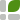

<h1>
  <picture>
    <source media="(prefers-color-scheme: dark)" srcset="site/public/brand/trellis-mark-dark.svg">
    
  </picture>
  Trellis
</h1>

Trellis is a layout engine for web apps where users arrange their own workspace. Panels nest inside panels as deep as users like, and the view zooms to whichever part they need, with every view kept mounted. Users can also drag, split, float and hide tabbed panels.

See the idea in the [2-minute video](https://www.youtube.com/watch?v=Kd9AbKawwhg) that started the project.

## Packages

| Package                                           |                                                                            |
| ------------------------------------------------- | -------------------------------------------------------------------------- |
| [`@danfessler/trellis`](packages/core)            | The framework-agnostic core: model, runtime and styles.                    |
| [`@danfessler/trellis-react`](packages/react)     | React components and hooks.                                                |
| [`@danfessler/trellis-element`](packages/element) | `<trellis-workspace>` custom element, including a standalone script build. |

## Quick start (React)

Install the core and the React adapter:

```sh
npm install @danfessler/trellis @danfessler/trellis-react
```

Declare the view types, then the initial layout:

```tsx
import { Workspace, ViewType, Split, Stage, Panel, View, useView } from "@danfessler/trellis-react";
import "@danfessler/trellis/style.css";

function Document() {
  const view = useView<{ file: string }>();
  return <Canvas file={view.params.file} />;
}

export function App() {
  return (
    <Workspace theme="dark" storageKey="my-app" version={1}>
      <ViewType id="document" title={(v) => String(v.params.file)} placement="stage" allow={{ side: false }}>
        <Document />
      </ViewType>
      <ViewType id="layers" title="Layers" singleton allow={{ stage: false }}>
        <Layers />
      </ViewType>

      <Split weights={[4, 1]}>
        <Stage empty={<OpenFilePrompt />}>
          <Panel>
            <View type="document" params={{ file: "cover.psd" }} />
          </Panel>
        </Stage>
        <View type="layers" />
      </Split>
    </Workspace>
  );
}
```

## Quick start (vanilla)

Install the core:

```sh
npm install @danfessler/trellis
```

Create a workspace in an element:

```ts
import { createWorkspace, layout as L } from "@danfessler/trellis";
import "@danfessler/trellis/style.css";

const ws = createWorkspace(document.getElementById("app")!, {
  types: {
    notes: { title: "Notes", mount: (el) => void (el.innerHTML = "<textarea></textarea>") },
    docs: { title: "Docs", iframe: "https://example.com" },
  },
  defaultLayout: L.row([L.view("notes"), L.stage(L.panel(L.view("docs")))], [1, 3]),
});

ws.open("notes", { placement: "float" });
```

## Documentation

- [Introduction](docs/introduction.md) and [Installation](docs/installation.md)
- Quick starts for [React](docs/quick-start-react.md) and [vanilla JavaScript](docs/quick-start-vanilla.md)
- [Concepts](docs/concepts.md)
- Reference: [React API](docs/react-api.md), [Core API](docs/core-api.md) and [Web component](docs/web-component.md)
- [Recipes](docs/recipes.md) and [FAQ](docs/faq.md)
- [Migrating from react-dockable](docs/migrating-from-react-dockable.md)

## Development

```sh
npm install
npm run dev          # website and docs at http://localhost:5320
npm test             # unit tests (Vitest)
npm run test:e2e     # browser tests (Playwright: Chromium and Firefox; WebKit in CI)
npm run typecheck
npm run build        # the three packages
npm run build:all    # packages + website with examples (site/dist)
npm run verify:pack  # pack tarballs and build a fresh app against React 18 and 19
```

The browser tests serve the test app on port 5330 and reuse whatever is already there; `E2E_PORT=5332 npm run test:e2e` picks another port. Playwright's WebKit doesn't run on older macOS releases; to run it locally, use Playwright's Linux image (`mcr.microsoft.com/playwright`) with `CI=true`.

The examples live in [`examples/`](examples):

| Example                       | Shows                                                                                                  | Run                                      |
| ----------------------------- | ------------------------------------------------------------------------------------------------------ | ---------------------------------------- |
| [`paint`](examples/paint)     | An art program: documents on the stage, tool palettes, floating navigator, close guards, persistence   | `npm run dev -w trellis-example-paint`   |
| [`ide`](examples/ide)         | An editor with explorer, terminal, live-preview iframe, command palette and status bar                 | `npm run dev -w trellis-example-ide`     |
| [`desktop`](examples/desktop) | A desktop environment built from public primitives, with stage floats, free zoom, a dock and a minimap | `npm run dev -w trellis-example-desktop` |
| [`vanilla`](examples/vanilla) | A framework-free ops dashboard, plus a `<trellis-workspace>` page declared in HTML                     | `npm run dev -w trellis-example-vanilla` |

## License

Trellis is free for non-commercial use. Commercial use requires an active [GitHub Sponsorship](https://github.com/sponsors/danfessler) at the applicable tier (organizations of 10 or fewer developers), and larger organizations need an enterprise license. See [LICENSE.md](LICENSE.md).
